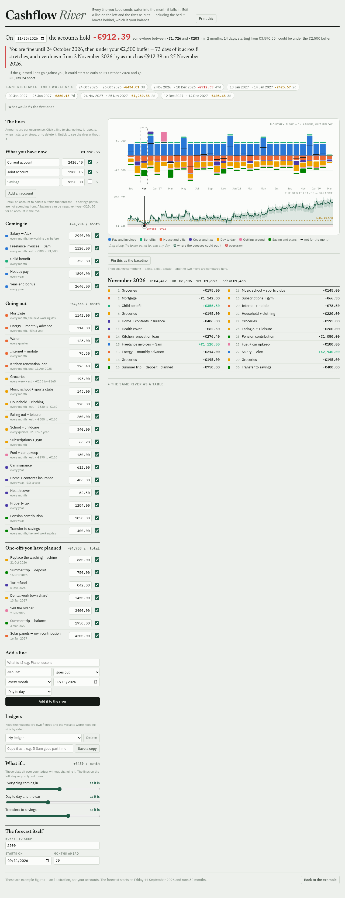
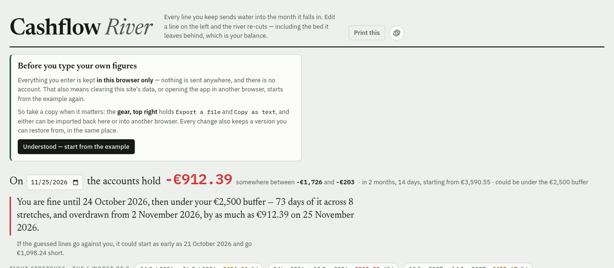
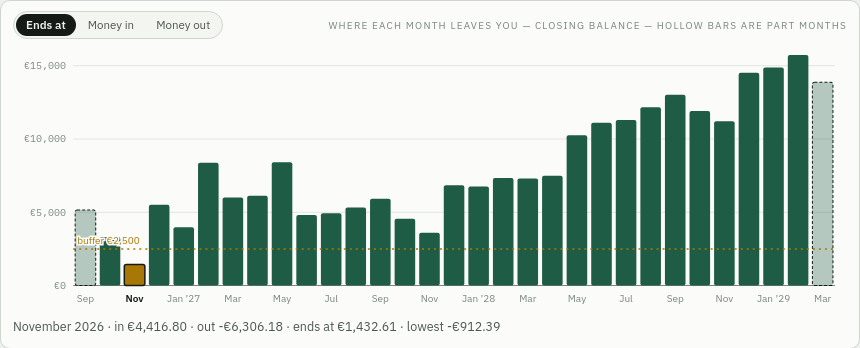
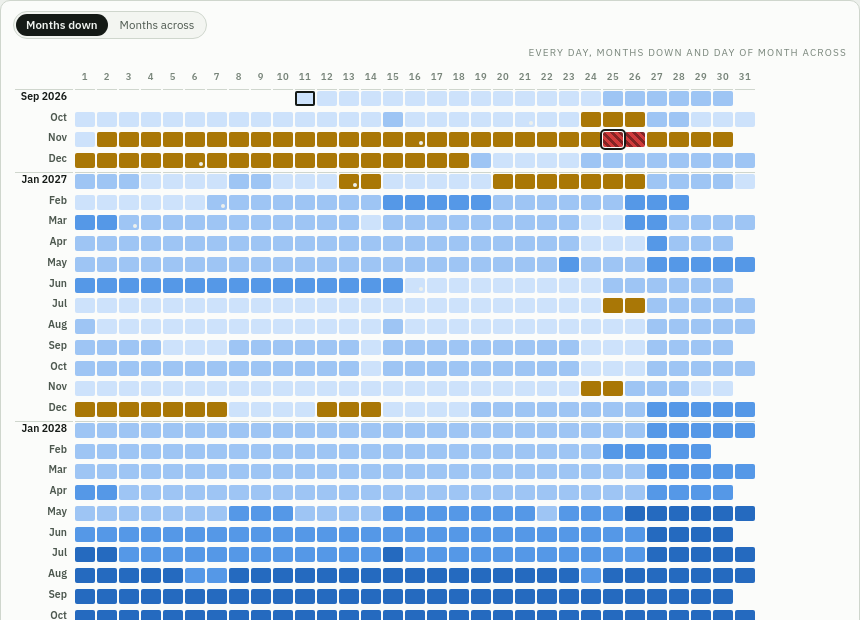
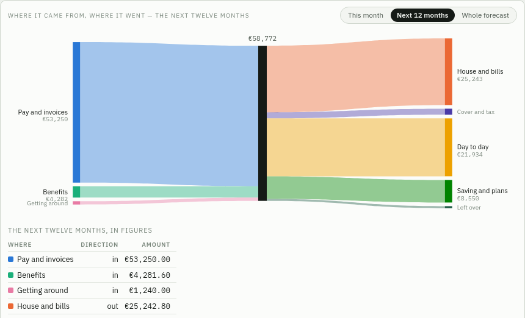

# Moraview — Cashflow River

**Open it: https://beyto1974.github.io/cashflow-river/**

What does my money look like on a given future date? You describe what comes in
and what goes out — recurring lines and planned one-offs — and the forecast runs
day by day from today to the horizon.



*The example household the app opens on: one sentence saying what happens and
when, the tight stretches as chips, and the river of monthly flow over the
balance it leaves behind. The same page in the viewer's dark theme:*
*[app-dark.png](docs/screens/app-dark.png).*

Three interfaces were prototyped over one engine; the **Cashflow River** is the
one that was built out. See `docs/interfaces.md` for all three and why, and
`docs/river-roadmap.md` for what is done and what is left.

## Where your figures live

Everything is kept in the browser you open it in — no account, no server, no
analytics, nothing sent anywhere. The published page is a single static file:
GitHub Pages serves it and never sees a figure. The app says so the first time
it opens, and says how to take a copy:



## What it does

- **A ledger you can actually type into** — accounts, every line editable in
  place, cadences, payment-day rules, yearly rises, guesses with a range.
- **One sentence at the top** saying what happens and when: *"You are fine until
  24 October, then under your €2,500 buffer — 73 days of it across 8 stretches,
  and overdrawn from 2 November."* What the guesses could do to that is said
  separately, never as fact.
- **The smallest fix.** On demand, a search for the least disruptive single
  change that clears the first tight stretch — put off a one-off, trim a line,
  split a payment — with the ones that clear everything marked.
- **Dials over the ledger.** Scale what comes in, or day-to-day spending,
  without touching what you typed; keep the figures or throw them away.
- **Two rivers side by side.** Pin a baseline, change something, see what it did
  month by month.
- **Five readings of the same forecast**, switched over the chart panel:

  | | |
  |---|---|
  | **River** | monthly flow above the balance it leaves (the picture above) |
  | **Balance** | the daily line on its own, with the band and the buffer |
  | **Month ends** | one bar per month — where it leaves you, or its total in or out |
  | **Grid** | every day as one cell, coloured by that evening's closing balance — a month a row and days across, or turned the other way to pack more months in |
  | **Flow** | a Sankey of where the money came from and went over a chosen period |

  
  
  

  `docs/flow-views.md` says what the last two are good and bad at.
- **It works on a phone.** The forecast comes first, the ledger is folded into
  sections under it, and nothing scrolls sideways:
  [app-phone.png](docs/screens/app-phone.png).
- **Named ledgers with a version history**, kept in the browser, exported to a
  JSON file or the clipboard and imported back — an import never overwrites.
- **The file format, documented in the page**, generated from the constants the
  importer checks against: paste it to a model with your own situation and
  import what it writes.
- **A print stylesheet** for the kitchen-table conversation.
- **Readable with a screen reader**: the answer as a sentence, one status region
  for what the app did on its own, headings for the sections, named controls,
  and keyboard walks through both the month columns and the grid's days.

## Run it

```bash
npm install
npm run dev      # Vite dev server; the port is printed
npm test         # Vitest over the domain
npm run check    # svelte-check and tsc
npm run bench    # what a change costs
npm run e2e      # Playwright against a real browser
npm run verify   # all three checks, in order
npm run build    # one self-contained HTML file in dist-app/
```

`npm run build` emits `dist-app/index.html` with everything inlined — no server,
no assets to copy. Open it, or put it behind any static host; that is exactly
what the published page is, built by `.github/workflows/pages.yml` on every push
to `master`.

The end-to-end suite starts its own dev server and needs to be told which port
to use, so it can never adopt one that is already serving something else. Two
environment variables:

```bash
E2E_PORT=4300 npm run e2e                    # required: a free port
MORAVIEW_CHROME=/path/to/chrome npm run e2e  # optional: skip playwright install
```

The build is a single file on purpose, so it can be published as-is.

## Layout

```
src/domain/       money in integer cents, calendar dates, cadences, payment-day
                  rules, the day-by-day projection and the band around it, the
                  rollups, the tight stretches, the sentence, the fix search and
                  the what-if layer — no UI, all tested
src/persistence/  the LedgerStore port, its browser adapter (named ledgers,
                  version history) and a validating codec
src/data/         the example household the app opens on
src/ui/           Svelte components, the colour bands, and the chart's geometry
                  as a pure model (tested separately from its rendering)
tests/            Vitest suites, written before the code they cover
e2e/              Playwright specs: the state container, storage, pointer and
                  keyboard handling and printing, in a real browser
scripts/bench.mjs what a change costs, so performance claims stay honest
legacy/           the three original single-file prototypes and their inlining
                  build; `node legacy/build.mjs` rebuilds them
docs/             the interfaces, the decision, the roadmap, the screenshots
                  this README shows
```

## How it is put together

- **Money is integer cents.** Euros exist only where a person types or reads
  one. The float prototype leaked (a monthly net of `2142.0199999999995`).
- **Dates are UTC calendar days** held as `YYYY-MM-DD`, so a summer-time change
  cannot move a payment.
- **One cadence registry.** Each cadence knows its label, its average rate per
  month and how to find its nth occurrence; adding one is a new entry, not an
  edit to the projection.
- **One projection.** `project(scenario)` is the only place a line becomes
  money; the month table, the breakdowns and the chart all read it. Every
  movement carries the likely amount and the two ends of its guess.
- **Guesses add in quadrature.** The band around the balance grows with the
  square root of the number of guessed occurrences, not their sum: a household
  does not have a dear grocery week every week for two years. Warnings read the
  low edge of that band, never the likely line.
- **Storage is behind a port.** The browser adapter is the only one today; a
  remote one can be added without the app knowing.

Nothing leaves the browser unless you export it: ledgers and their version
histories live in `localStorage`, a JSON export is the way to carry one
elsewhere, and there is a reset back to the example. No account, no service.
